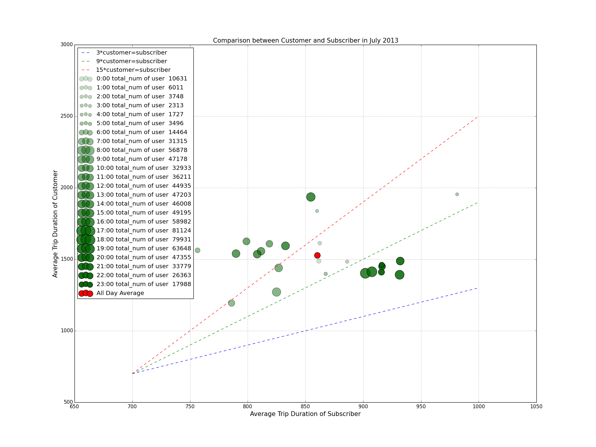

# HW8 Peer Review jz2308

Clarity: Title and the legend are confusing as it does not state that the comparison is trip duration. e.g. 3*customer = subscriber. This could be interpreted as the number of customers or subscribers. Also, it is unclear about what the different sizes of the dots represent.

Esthetic: The colors chosen are good.

Honesty: The limit of the y axis is three times that of the x axis while the width and the length of the frame is more or less the equal.

