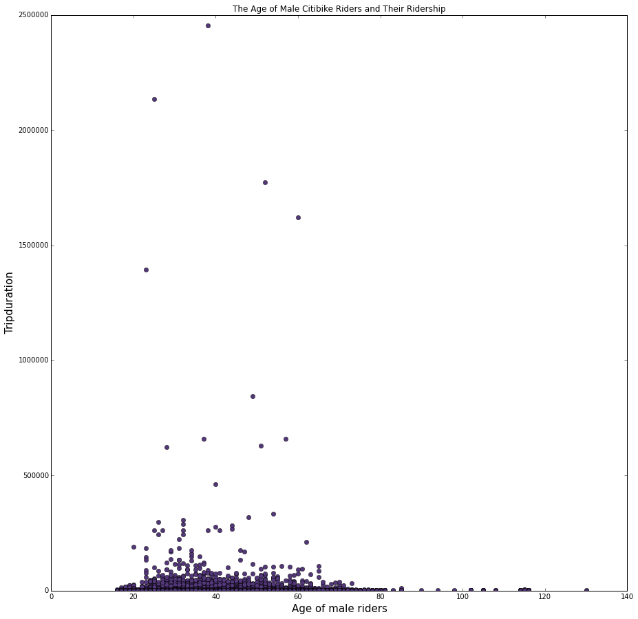

# HW8 Peer Review yx1088

Clarity: The plot has a clear idea to show the relationship between male riders' age and their trip duration. However, showing the scatterplot might not be optimal especially several outlier dots would exaggerate the difference between the younger groups and older groups. A suggestion would be to put riders of different ages into groups and show their average trip duration for comparison.

Honesty: It overemphasizes the long trip duration of the younger age groups.

