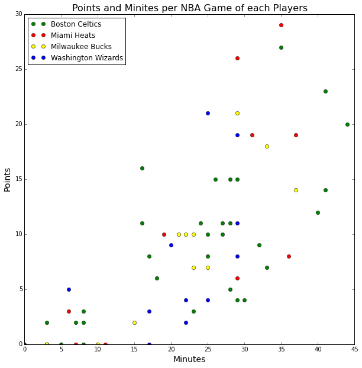

# HW8 Peer Review yx1125

Clarity: The plot has too much information in one scatterplot. It would be better to show the points and minutes of each one team or the total players of all the teams in one plot as four colors altogether are confusing.  Also, why does the legend on the left top corner show that each team is represented by two dots? I suppose that each player is represented by one dot instead of two dots so this is a bit confusing too.

Esthetic: The colors chosen are good.

Honesty: It is honestly reproducing the data.

